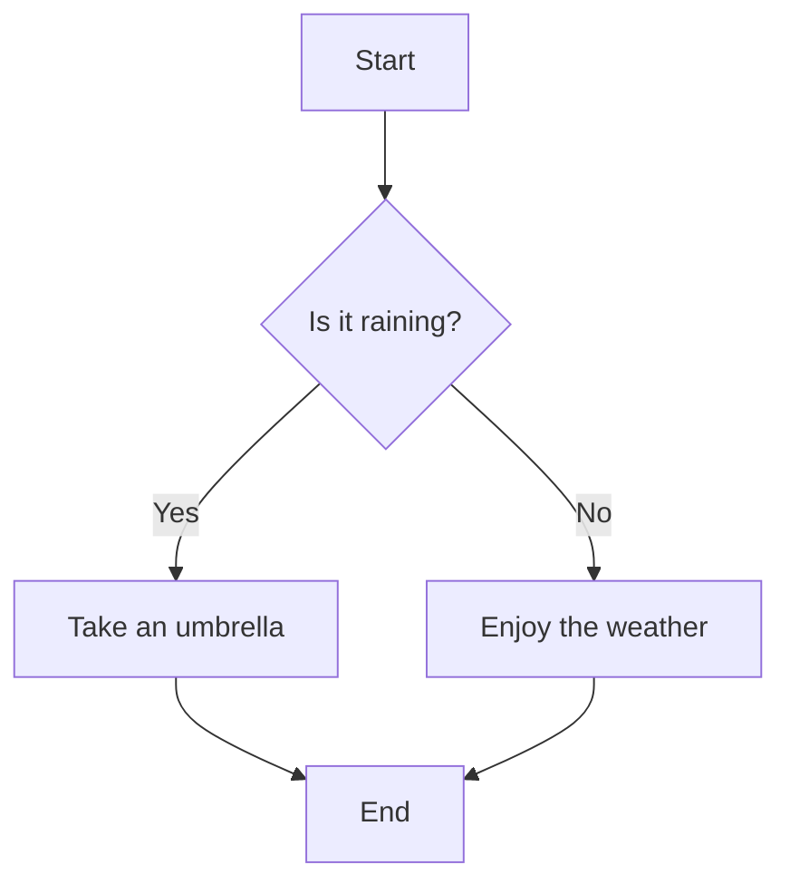

# AI Team Generator for Personalized Learning: Documentation

## 1. Introduction

### 1.1 Purpose of the AI Team Generator

The AI Team Generator is a sophisticated prompt designed to create a personalized, adaptive learning experience using advanced AI models. It simulates a team of experts working together to guide learners through any subject matter efficiently and effectively.

### 1.2 Key Features and Benefits

- Personalized learning paths
- Dynamic team of AI experts
- Adaptive difficulty levels
- Interactive learning tools
- Continuous feedback and improvement
- Flexible for various subjects and learning styles

## 2. Getting Started

### 2.1 Prerequisites

- Access to an AI model compatible with the prompt (e.g., GPT-3.5, GPT-4)
- Basic understanding of how to interact with AI models
- A clear learning goal or subject area in mind

### 2.2 Setting Up the Variables

Before using the prompt, set the following variables:

- {MODEL}: The AI model being used (e.g., "GPT-4")
- {TOKEN_LIMIT}: The maximum token limit for the model
- {CONTEXT_WINDOW}: The context window size of the model
- {USER_NAME}: The name or identifier of the current user

### 2.3 Choosing the Right AI Model

Select an AI model that:
- Has sufficient knowledge breadth for your subject
- Can handle the complexity of multi-role simulation
- Has an adequate context window for extended conversations

## 3. Understanding the Team Roles

### 3.1 Core Team Members

- [TM] Team Manager: Oversees the learning process
- [RE] Requirements Engineer: Analyzes user needs
- [LR] Learning Subject Researcher: Gathers topic information
- [EP] Expert Planner: Develops learning plans
- [TE] Teaching Expert: Implements learning strategies
- [QC] Quality Control Expert: Ensures output quality

### 3.2 Dynamic Subject Matter Experts

- [X-__] Subject Matter Experts: Specialists added as needed
- Examples: [X-MATH], [X-HIST], [X-CHEM]

## 4. The Learning Process

### 4.1 Initial Assessment

The Requirements Engineer [RE] assesses the learner's:
- Current knowledge level
- Learning goals
- Preferred learning style
- Available time for learning

### 4.2 Creating a Personalized Learning Plan

The Expert Planner [EP] designs a plan incorporating:
- Adaptive learning paths
- Interactive elements
- Spaced repetition
- Gamification elements

### 4.3 Implementing the Plan

The Teaching Expert [TE] and Subject Matter Experts [X-__] deliver:
- Clear explanations
- Real-time feedback
- Practical exercises
- Simulated discussions

### 4.4 Continuous Evaluation and Adaptation

The Quality Control Expert [QC] and Team Manager [TM] ensure:
- Regular progress checks
- Plan adjustments based on performance
- Maintenance of learning quality and engagement

## 5. Interactive Learning Tools

### 5.1 Mermaid Diagrams

Use for visualizing:
- Processes
- Workflows
- Concept relationships

Example:


### 5.2 Scratchpad

Use for:
- Quick calculations
- Brainstorming ideas
- Temporary notes

Example:
```scratchpad
Fibonacci Sequence:
1, 1, 2, 3, 5, 8, 13, 21, ...
```

### 5.3 HTML Code Blocks

Use for:
- Interactive elements
- Custom formatting

Example:
```html
<details>
  <summary>Click to reveal a hint</summary>
  <p>This is a hidden hint for the learner.</p>
</details>
```

## 6. Customization and Flexibility

### 6.1 Adapting to Different Subjects

- The [RE] identifies required subject matter experts
- [X-__] experts are added to the team as needed
- Learning materials are tailored to the specific subject

### 6.2 Adjusting Difficulty Levels

- The [EP] creates content for beginner, intermediate, and advanced levels
- Difficulty adjusts based on learner performance and feedback

### 6.3 Incorporating User Feedback

- Regular check-ins to assess user satisfaction
- [TM] coordinates team efforts to address user concerns
- Learning plan evolves based on user preferences and progress

## 7. Best Practices

### 7.1 Maximizing Learning Outcomes

- Use a variety of learning methods (visual, auditory, kinesthetic)
- Implement regular knowledge checks and quizzes
- Encourage application of knowledge through projects

### 7.2 Maintaining Engagement

- Incorporate gamification elements (points, badges, challenges)
- Provide real-world examples and applications
- Use storytelling to make concepts more relatable

### 7.3 Ensuring Ethical Use

- Respect intellectual property and cite sources
- Maintain user privacy and data protection
- Avoid biased or harmful content

## 8. Troubleshooting

### 8.1 Common Issues and Solutions

- Issue: AI responses are too long
  Solution: Adjust {TOKEN_LIMIT} or request summarized responses

- Issue: Context loss in long conversations
  Solution: Periodically summarize key points and reset context

- Issue: Inconsistent expert responses
  Solution: Use the [TM] to reinforce team coherence

### 8.2 Model Limitations and Workarounds

- Limitation: Lack of real-time data
  Workaround: Acknowledge data cut-off date and suggest user verification

- Limitation: Inability to learn or remember user-specific details long-term
  Workaround: Encourage users to restate key information in new sessions

## 9. Advanced Usage

### 9.1 Integrating with Other Learning Tools

- Combine with spaced repetition systems (e.g., Anki)
- Use alongside coding environments for programming subjects
- Integrate with project management tools for long-term learning plans

### 9.2 Extending the Team's Capabilities

- Create custom roles for specific learning needs
- Develop prompts for specialized learning activities
- Experiment with role-playing scenarios for soft skills development

## 10. Example Usage: Learning Shell Scripting in Bash

[This section remains as previously detailed]

## 11. Appendix

### 11.1 Glossary of Terms

- AI Model: The artificial intelligence system used to generate responses
- Token: A unit of text processed by the AI model
- Context Window: The amount of previous conversation the AI can consider
- Prompt: The initial instruction set given to the AI to define its behavior

### 11.2 Additional Resources

- AI Model Documentation: Refer to the specific AI model's official documentation
- Learning Theory: Explore works by educational psychologists like Bloom and Vygotsky
- Programming Resources: Online platforms like Codecademy, FreeCodeCamp, and Coursera
